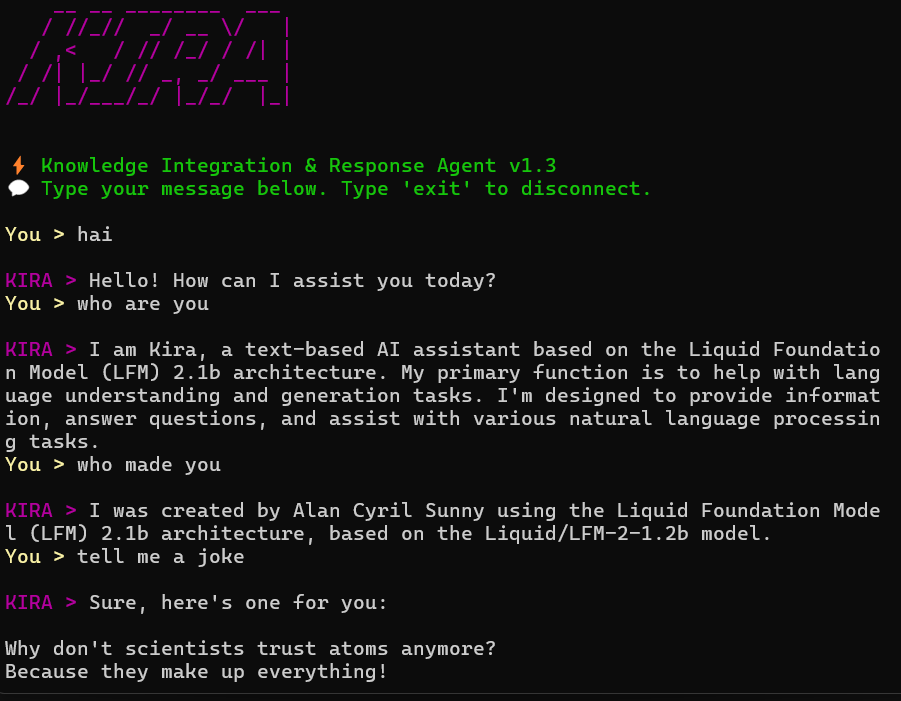

# ⚡ KIRA - Knowledge Integration & Response Agent v1.3


-purple)


> **Developed by ALAN CYRIL SUNNY**  
> If you like this project, please ⭐ [star the repository](https://github.com/dragonpilee/kira-terminal-chatbot)!

---

## 🧠 KIRA - Knowledge Integration & Response Agent

A fast, elegant, and responsive terminal-based AI assistant powered by your local `liquid/lfm2-1.2b` model via LM Studio.

- 💬 Real-time, token-by-token streamed output  
- 🎨 Beautiful, colorful terminal UI with `rich` and ASCII banners via `pyfiglet`  
- 🧠 Multi-turn conversation memory  
- 🧬 Identity-aware (Name: KIRA, Version: 1.3, Creator: Alan Cyril Sunny)  
- ⌨️ Glitchy effects and slow typing for hacker vibes  
- ⚙️ Fully configurable API/model settings  
- 🔒 100% local processing for privacy and control  
- ⚡ **Supports both NVIDIA CUDA and AMD ROCm GPUs for accelerated inference**  

---

## ✨ Features

- **Identity Awareness**: KIRA always knows her name, version, and creator.
- **Streamed Output**: See responses appear live, token by token.
- **Rich Terminal UI**: Styled with `rich` and ASCII art banners.
- **Conversation Memory**: Remembers previous turns for context.
- **Customizable**: Easily tweak API/model via environment variables.
- **Local & Private**: All data stays on your machine.
- **GPU Support**: Works with NVIDIA CUDA and AMD ROCm supported GPUs.

---

## 🛠️ Tech Stack

- **Language**: Python 3.8+
- **Terminal UI**: [rich](https://github.com/Textualize/rich), [pyfiglet](https://github.com/pwaller/pyfiglet)
- **AI Model**: liquid/lfm2-1.2b (via [LM Studio](https://lmstudio.ai/))
- **Model Serving**: LM Studio (REST API)
- **API Communication**: REST API (HTTP)
- **GPU Acceleration**: NVIDIA RTX GPU (CUDA) or AMD GPU (ROCm) for faster inference

---

## 💻 Requirements

- Python 3.8 or higher
- LM Studio running locally at `http://localhost:1234`
- Installed model: `liquid/lfm2-1.2b` or compatible
- *(Optional)* NVIDIA CUDA or AMD ROCm supported GPU for acceleration

---

## 🚀 Installation

1. *(Optional)* Create and activate a virtual environment:
   ```bash
   python -m venv .venv
   .venv\Scripts\activate   # Windows
   ```

2. Install the required Python packages:
   ```bash
   pip install requests rich pyfiglet
   ```

3. Start LM Studio with the `liquid/lfm2-1.2b` model and keep it listening on `http://localhost:1234`.

---

## ⚡ Quick Start

With LM Studio running, launch KIRA:
```bash
python kira.py
```

You'll see the stylized ASCII banner and can chat live in your terminal.  
Type `'exit'` to gracefully disconnect.

---

## 📝 Usage

1. **Run the bot** in your terminal.
2. **Chat with KIRA** in natural language.
3. **Enjoy real-time, styled responses** with memory and glitch effects.

---

## 💡 Example Prompts

- "Who are you?"
- "Summarize the latest conversation."
- "Tell me a programming joke."
- "What's your version and creator?"

---

## 🔧 Environment Variables (Optional)

| Variable            | Description                              | Default                      |
|---------------------|------------------------------------------|------------------------------|
| `LM_STUDIO_API_URL` | LM Studio API endpoint                   | `http://localhost:1234/v1`   |
| `MODEL_NAME`        | Model name used for completions          | `liquid/lfm2-1.2b`           |

---

## 📸 Demo



---

## 📁 Project Structure

```
📦 kira-terminal-chatbot/
 ┣ kira.py                # Main chatbot script
 ┗ README.md              # Project README
```

---

## 🧠 Identity Prompt

KIRA is always aware of her identity:

```text
Your name is KIRA.
Your version is 1.3.
Your creator is Alan Cyril Sunny.
You are based on the model liquid/lfm2-1.2b.
```

---

## 👨‍💻 Developer

**Alan Cyril Sunny**  
🔗 [GitHub](https://github.com/dragonpilee) | 📫 alancyrilsunny@protonmail.com

---

## 📜 License

MIT License. Free to use, modify, and share.

---

> ✨ “May the shadows keep you safe.” —
